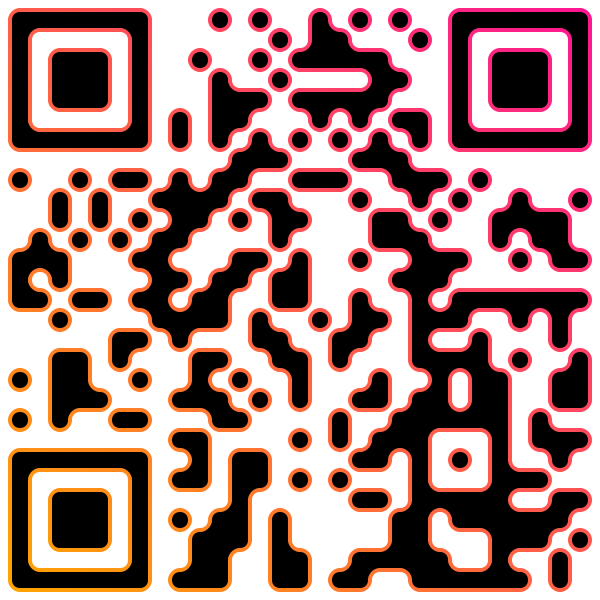

[![npm version][npm-image]][npm-url]
[![Downloads][downloads-image]][downloads-url]
[![install size][install-size-image]][install-size-url]

<p align="center">
  
</p>

# SvgQr.js
QR code renderer into SVG with rounded edges

# Installation
#### Npm:

`npm install svgqr.js`

#### Yarn:

`yarn add svgqr.js`

# Usage

```javascript
const SvgQr = require('svgqr.js'); // For NodeJS
import SvgQr from 'svgqr.js'; // For Webpack

// Simple usage
let svg = SvgQr('Hello, World!');

// With options
let svg = SvgQr('Hello, World!', {
  correction: 'H'
});

// svg = '<svg ...> ... </svg>'
```

# API Reference
### `SvgQr(data, opts [optional])` - encode and render QR code into SVG string
- `data` — data to encode
- `opts` — object with options fields:

    Name | Default | Description
    ---- | ------- | -----------
    `version` | `0` | QR code version, `0` (auto) \| from `1` to `40`
    `correction` | `'M'` | Error correction level, `'L'` (7%) \| `'M'` (15%) \| `'Q'` (25%) \| `'H'` (30%)
    `mode` | `'Byte'` | Data encoding mode, `'Numeric'` \| `'Alphanumeric'` \| `'Byte'`
    `encoding` | `'default'` | Text encoding, `'default'` (bytes) \| `'UTF-8'`
    `corners` | `'None'` | Corners style, `'None'` \| `'Rounded'` \| `'Skew'`
    `radius` | `1` | Radius for `'Rounded'` \| `'Skew'` styling
    `padding` | `0` | Number of clear modules around QR

# Advanced styling

You can specialize corners design for all 8 types of turn directions (the first letters of direction, Right-Up will be `ru` and etc.)

The filled area will always be on the right as you move

```javascript
SvgQr('Hello, World!', {
    corners: {
        ru: 'Rounded',  // For each corner you can specify style
        ld: 'Skew', // If not specified, the order of the letters does not matter ('dl' == 'ld')
        // Skipped options will be default 'None'
        dr: 'l0.75 0.25l0.25 0.75', // You can specify custom svg path
        rd: 'l0.25 0.25h0.5v0.5l0.25 0.25'
    },
    radius: { // Specifying radius is completely similar
        ru: 1,
        ld: 0.75,
        dl: 0
    }
});
```

This code will produce:
<p align="center">
  
</p>

# Todo
- [x] Optimize 5 paths into 1
- [x] Add styling options

# License
MIT licensed

Copyright (C) 2019 Aleksandr Krotov

[npm-image]: https://img.shields.io/npm/v/svgqr.js.svg?style=flat-square
[npm-url]: https://npmjs.org/package/svgqr.js
[downloads-image]: http://img.shields.io/npm/dm/svgqr.js.svg?style=flat-square
[downloads-url]: https://npmjs.org/package/svgqr.js
[install-size-image]: https://flat.badgen.net/packagephobia/install/svgqr.js
[install-size-url]: https://packagephobia.now.sh/result?p=svgqr.js
